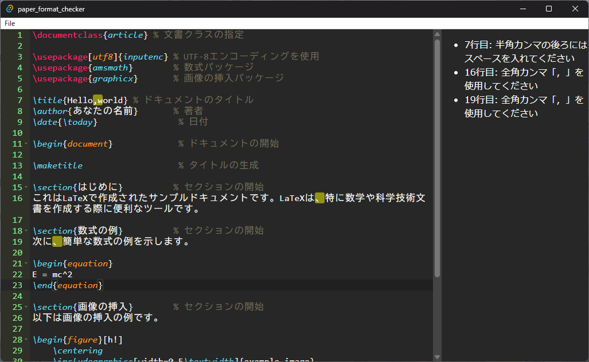

# paper_format_cheker
論文のフォーマットを正規表現に基づいてチェックします。

## 使い方
1. rules.jsonをpaper_format_cheker.exeと同じディレクトリに配置
2. paper_format_checker.exeを起動
3. 上部のメニューからFile Open...を選択し開きたいtexファイルを選択する

## rules.jsonの編集方法
regexに検知させたいルールを正規表現で記述。バックスラッシュを正しく解釈させるためには2つ入力する必要があることに注意。errorにはマッチした際に表示させるエラーテキストを入力。"comma-space"などの名前は自由。デフォルト設定は以下
```json
{
  "comma-space": {
    "regex": ",[^\\s]",
    "error": "半角カンマの後ろにはスペースを入れてください"
  },
  "zenkaku-comma": {
    "regex": "、",
    "error": "全角カンマ「，」を使用してください"
  },
  "hankaku-comma": {
    "regex": "(?<=[a-zA-Z](?:\\\\cite\\{.*\\})?)．",
    "error": "半角ピリオド「.」を使用してください"
  },
  "cite-error": {
    "regex": "(?<=[．.])\\\\cite\\{.*\\}",
    "error": "引用はピリオドの前です"
  }
}
```

